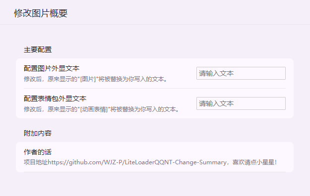

## 实现图片+表情包的外显缩略文本修改功能

<!-- PROJECT SHIELDS -->

[![Contributors][contributors-shield]][contributors-url]
[![Forks][forks-shield]][forks-url]
[![Stargazers][stars-shield]][stars-url]
[![Issues][issues-shield]][issues-url]
[![MIT License][license-shield]][license-url]
[![LinkedIn][linkedin-shield]][linkedin-url]

<!-- PROJECT LOGO -->

  
  <h1 align="center">Change Summary</h1>
  

    <a href="https://github.com/WJZ-P/LiteLoaderQQNT-Change-Summary">查看Demo</a>
    ·
    <a href="https://github.com/WJZ-P/LiteLoaderQQNT-Change-Summary/issues">报告Bug</a>
    ·
    <a href="https://github.com/WJZ-P/LiteLoaderQQNT-Change-Summary/issues">提出新特性</a>
  

  

<h2 align="center">"若你能命中我
自宇宙的中央
镜片里能不能
留下我的模样"
</h2>

## 目录

- [Echo Message](#projectname)
    - [目录](#目录)
        - [上手指南](#上手指南)
            - [开发前的配置要求](#开发前的配置要求)
            - [**插件安装步骤**](#安装步骤)
        - [**使用方法**](#使用方法)
        - [版权说明](#版权说明)
        - [鸣谢](#鸣谢)

## 上手指南

###### 开发前的配置要求

1. 请安装LiteLoader，项目地址为 https://github.com/LiteLoaderQQNT/LiteLoaderQQNT

2. 下面是社区开发的LiteLoader快捷安装脚本项目，新手请直接下载下面的即可。
   https://github.com/Mzdyl/LiteLoaderQQNT_Install/

#### 此处提供两个链接：

- [LiteLoader QQNT 下载地址](https://github.com/LiteLoaderQQNT/LiteLoaderQQNT/releases)
- [LiteLoader QQNT 安装脚本](https://github.com/Mzdyl/LiteLoaderQQNT_Install/releases)

#### 对于网络不好的用户，可以使用以下直链进行下载：

- [LiteLoader QQNT 安装器直链][LL-installer-link]
- [QQ9.9.15.26909_x64 版本直链][oldQQ-download-link]

###### 安装步骤

1. 下载release中的最新版本
2. 解压后把整个解压出来的文件夹拖动到Plugins目录下即可。
3. 重启QQ，LiteLoader会自动加载插件。

### 注意，如果使用了上面的install脚本安装liteloader，QQ设置会自带插件商店，在插件商店里可以一键安装本插件。

# 使用方法

## 进入设置界面，输入你想要显示的外显文本即可

  

## 版权说明

该项目签署了EPL-2.0 license
授权许可，详情请参阅 [LICENSE](https://github.com/WJZ-P/LiteLoaderQQNT-Change-Summary/blob/main/LICENSE)

## 鸣谢

- [LiteLoader QQNT](https://github.com/LiteLoaderQQNT/LiteLoaderQQNT?tab=readme-ov-file)

## 如果您喜欢本项目，请给我点个⭐吧(๑>◡<๑)！

## ⭐ Star 历史

<!-- links -->

[your-project-path]:WJZ-P/LiteLoaderQQNT-Change-Summary

[contributors-shield]: https://img.shields.io/github/contributors/WJZ-P/LiteLoaderQQNT-Change-Summary.svg?style=flat-square

[contributors-url]: https://github.com/WJZ-P/LiteLoaderQQNT-Change-Summary/graphs/contributors

[forks-shield]: https://img.shields.io/github/forks/WJZ-P/LiteLoaderQQNT-Change-Summary.svg?style=flat-square

[forks-url]: https://github.com/WJZ-P/LiteLoaderQQNT-Change-Summary/network/members

[stars-shield]: https://img.shields.io/github/stars/WJZ-P/LiteLoaderQQNT-Change-Summary.svg?style=flat-square

[stars-url]: https://github.com/WJZ-P/LiteLoaderQQNT-Change-Summary/stargazers

[issues-shield]: https://img.shields.io/github/issues/WJZ-P/LiteLoaderQQNT-Change-Summary.svg?style=flat-square

[issues-url]: https://img.shields.io/github/issues/WJZ-P/LiteLoaderQQNT-Change-Summary.svg

[license-shield]: https://img.shields.io/github/license/WJZ-P/LiteLoaderQQNT-Change-Summary.svg?style=flat-square

[license-url]: https://github.com/WJZ-P/LiteLoaderQQNT-Change-Summary/blob/main/LICENSE

[linkedin-shield]: https://img.shields.io/badge/-LinkedIn-black.svg?style=flat-square&logo=linkedin&colorB=555

[linkedin-url]: https://linkedin.com/in/shaojintian

[oldQQ-download-link]:https://plat-sh-community-prod-upload-ugc.oss-cn-shanghai.aliyuncs.com/upload/2024/09/24/437001026/70ba06146cc3817109214d56dd280e95_5952845132396831848.jpg

[LL-installer-link]:https://plat-sh-community-prod-upload-ugc.oss-cn-shanghai.aliyuncs.com/upload/2024/09/24/437001026/cc9702b90653ca48f4fd5222636bb527_2445931754753249733.jpg

